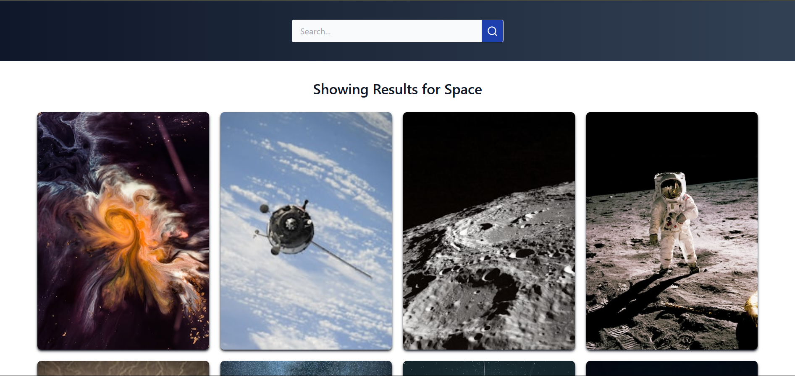

# ImageHunt

Welcome to **ImageHunt**, an image search application built with React and styled using Tailwind CSS. This application leverages the Unsplash API to deliver stunning, high-quality images, providing users with a seamless and visually appealing experience.

## Features

- **Dynamic Image Search**: Search for breathtaking images using keywords.
- **Skeleton Loading**: Enjoy a smooth experience with loaders while images are being fetched.
- **Responsive and Clean UI**: Designed for optimal performance across all devices.
- **Powered by Unsplash API**: Fetches a wide range of high-quality images directly from Unsplash.

## Tech Stack

- **React**: For building a dynamic and efficient user interface.
- **Tailwind CSS**: For a clean, responsive, and modern design.
- **Unsplash API**: For fetching image data.

## Installation

Follow these steps to run ImageHunt locally:

1. Clone the repository:
   ```bash
   git clone https://github.com/HeyThereParth/ImageHunt.git
   cd ImageHunt
   ```

2. Install the required dependencies:
   ```bash
   npm install
   ```

3. Set up your Unsplash API key:
   - Create a `.env` file in the root directory.
   - Add the following line to the file:
     ```env
     VITE_ACCESS_KEY=your_api_key
     ```

4. Start the development server:
   ```bash
   npm run dev
   ```

5. Open your browser and navigate to:
   ```
   http://localhost:5173
   ```

## How to Use

1. Enter a keyword in the search bar.
2. Browse through high-quality images fetched from Unsplash.
3. Enjoy the smooth and responsive user experience.

## Screenshot




## Acknowledgements

- [Unsplash API](https://unsplash.com/developers) for the fantastic image database.
- [React](https://reactjs.org/) for its efficient and flexible framework.
- [Tailwind CSS](https://tailwindcss.com/) for making UI development easier and faster.